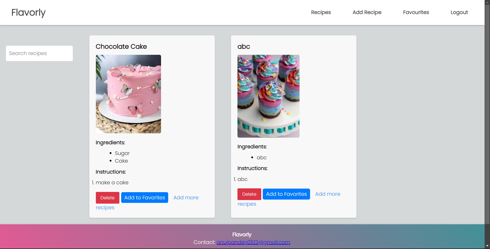
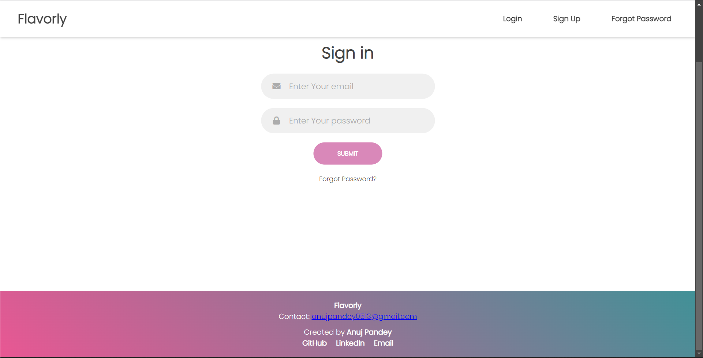

# Recipe Sharing Full Stack App (MERN Stack)
## Live Demo

Check out the live demo of the application here:


A web application for sharing and discovering recipes, built with the MERN stack (MongoDB, Express.js, React, Node.js). Users can create, manage, and explore a wide variety of culinary delights.

## Screenshots






## Features

1. **User Authentication**: Secure user authentication and registration system.
2. **Recipe Management**: Create, edit, and delete your recipes.
3. **Recipe Discovery**: Browse and search for recipes shared by other users.
4. **Comments and Ratings**: Leave comments and rate recipes.
5. **Favorite Recipes**: Save your favorite recipes for easy access.
6. **Responsive Design**: Works seamlessly on both desktop and mobile devices.

## Prerequisites

- [Node.js](https://nodejs.org/) installed (v14 or higher).
- [MongoDB](https://www.mongodb.com/) installed and running locally or on a remote server.
- [Git](https://git-scm.com/) for version control.
- A text editor or integrated development environment (IDE) of your choice (e.g., Visual Studio Code).

## Getting Started

1. Clone the repository:

   ```bash
   git clone https://github.com/AnujPandey123/Flavorly.git
2. Navigate to the project directory:

       cd Flavorly   


4. Install client dependencies:

       npm install 


5. Start the development server

       npm start

## Technologies Used
  ### Frontend:
  
  1. React: A JavaScript library for building user interfaces.
  2. React Router: For routing and navigation.

  
